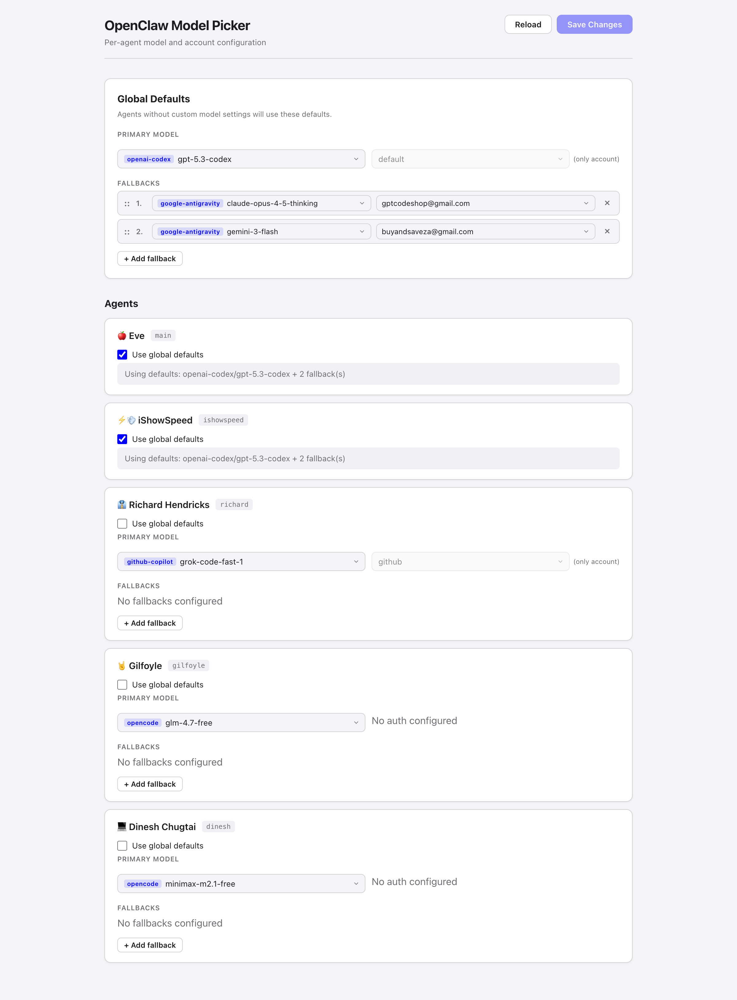
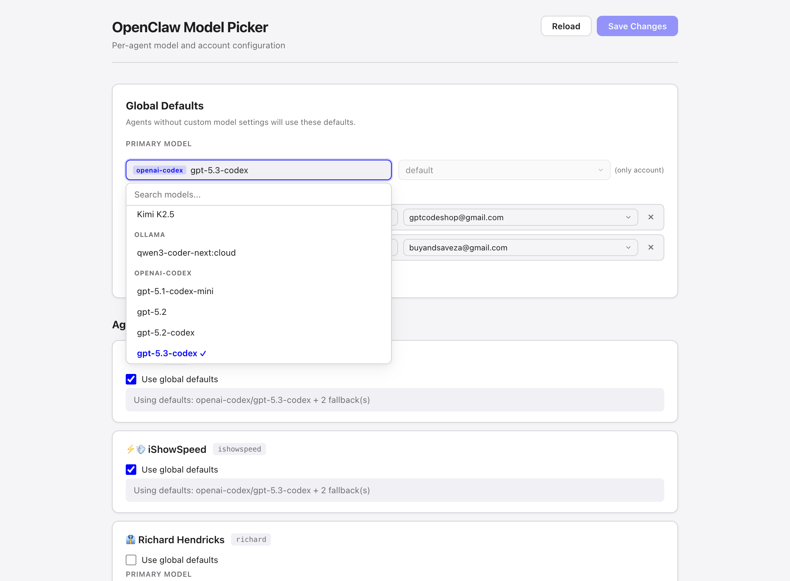

# OpenClaw Model Picker

A local web UI for configuring which AI models and accounts your [OpenClaw](https://github.com/nichochar/openclaw) agents use. Manage global defaults, per-agent overrides, and fallback chains from a single dashboard instead of editing JSON by hand.



## Features

- **Global defaults** with primary model and ordered fallback chain
- **Per-agent overrides** or inherit from defaults with a single checkbox
- **Searchable model dropdowns** with type-to-filter, keyboard navigation, and provider grouping
- **Auto-discovery of custom providers** (e.g. Ollama, local models) alongside built-in models
- **Multi-account support** per provider with automatic filtering by provider
- **Drag-and-drop fallback ordering**
- **Live reload** from `openclaw.json` -- no restart needed
- **Safe writes** with atomic file operations and rotating backups (5 generations)
- **Light and dark mode** via `prefers-color-scheme`



## Quick Start

```bash
# Clone
git clone https://github.com/TH33ORACL3/openclaw-model-picker.git
cd openclaw-model-picker

# Install and run
pnpm install
pnpm dev
```

Open [http://localhost:5199](http://localhost:5199) in your browser.

## Prerequisites

- **Node.js** 18+
- **pnpm** (or npm/yarn)
- An existing OpenClaw installation with `~/.openclaw/openclaw.json`

## How It Works

```
Browser (localhost:5199)
        |
        |  GET/POST /api/config
        |  GET/POST /api/state
        v
Vite Dev Server (plugin middleware)
        |
        |  read/write
        v
~/.openclaw/openclaw.json       <- main config (models, agents, auth)
~/.openclaw/model-picker-state.json  <- UI preferences (account selections)
```

The Model Picker reads directly from your OpenClaw config file. When you save changes:

1. Config is written atomically (write to `.tmp`, then rename)
2. Previous config is backed up (`.bak`, `.bak.1`, ... `.bak.5`)
3. `meta.lastTouchedAt` is updated, which triggers the OpenClaw gateway's file watcher
4. Gateway auto-reloads -- no manual restart needed

## Model Sources

The picker merges models from two places in `openclaw.json`:

| Source | Path | Purpose |
|--------|------|---------|
| Built-in registry | `agents.defaults.models` | Models from OpenClaw's known providers |
| Custom providers | `models.providers.*` | Self-hosted or third-party models (Ollama, etc.) |

Models are deduplicated by canonical ID (`provider/model-id`). If a model exists in both sources, the registry entry takes priority (preserving any custom alias).

## Project Structure

```
model-picker/
  index.html                    # Shell HTML
  vite.config.js                # Vite config, loads API plugin
  package.json
  server/
    plugin.js                   # Vite middleware: /api/config, /api/state
    config-io.js                # Read/write openclaw.json with backups
    state-io.js                 # Read/write model-picker-state.json
  src/
    main.js                     # Entry point, state init, save/reload
    state.js                    # Reactive state store (subscribe/update)
    render.js                   # DOM rendering orchestrator
    api.js                      # Fetch client for /api endpoints
    style.css                   # All styles (light/dark, responsive)
    components/
      defaults-panel.js         # Global defaults section
      agent-card.js             # Per-agent config card
      model-select.js           # Searchable model dropdown
      account-select.js         # Auth profile picker
      fallback-list.js          # Drag-sortable fallback chain
      toast.js                  # Notification toasts
    utils/
      config.js                 # Model resolution/serialization helpers
      providers.js              # Provider parsing, grouping, model merging
```

## Configuration Reference

The picker reads and writes these sections of `openclaw.json`:

### `agents.defaults.model`

```jsonc
{
  "primary": "google-antigravity/claude-sonnet-4-5",
  "fallbacks": [
    "google-antigravity/gemini-3-flash",
    "google-antigravity/gemini-3-pro-low"
  ]
}
```

### `agents.list[].model`

Per-agent override. Omit to inherit global defaults.

```jsonc
{
  "id": "richard",
  "model": "github-copilot/grok-code-fast-1"
  // or omit "model" to use defaults
}
```

### `models.providers`

Custom model providers auto-discovered by the picker.

```jsonc
{
  "ollama": {
    "api": "openai-completions",
    "baseUrl": "http://127.0.0.1:11434/v1",
    "models": [
      {
        "id": "qwen3-coder-next:cloud",
        "contextWindow": 131072,
        "maxTokens": 16384
      }
    ]
  }
}
```

## Tech Stack

- **[Vite](https://vitejs.dev/)** -- dev server + build tooling
- **Vanilla JS** -- no framework, no build-time dependencies
- **CSS custom properties** -- theming via `light-dark()` and `color-scheme`

## License

MIT
